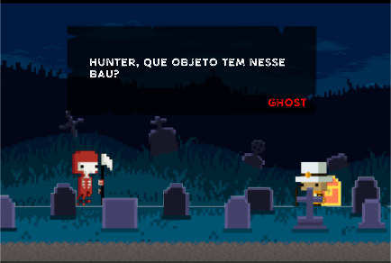
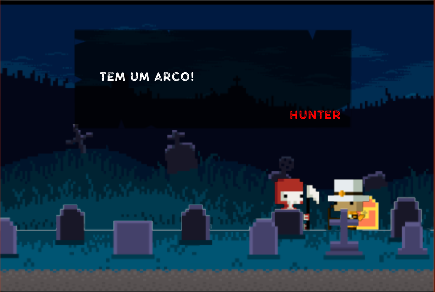

# Trabalho 02 - TracerySharp aplicado em jogos Unity2D

## **Introdução**
**Tracery** é uma biblioteca para gerar frases aleatórias baseadas em diversas bibliotecas, para utilizar no Unity usamos **TracerySharp** desenvolvido pelo usuário de Git [mkremins](https://github.com/mkremins/TracerySharp) para agilizar no desenvolvimento de diálogos dentro do jogo, e como parte da atividade T02 realizamos uma aplicação e abaixo se encontram os resultados obtidos.

_projeto desenvolvido:_ [Link](https://github.com/Emiliandro/TE-projects/tree/master/TE02Project)

## **using Tracery**

