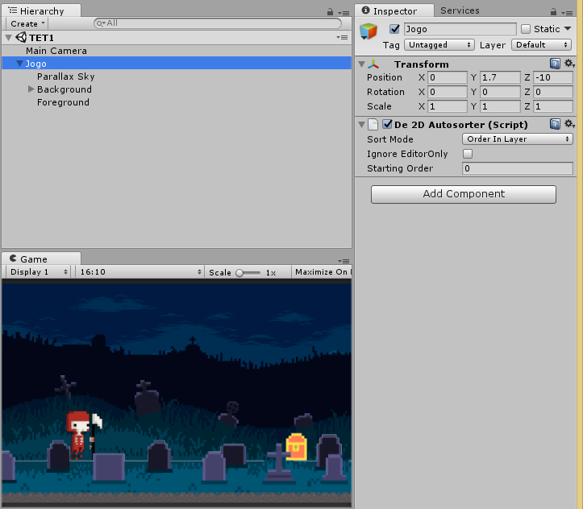
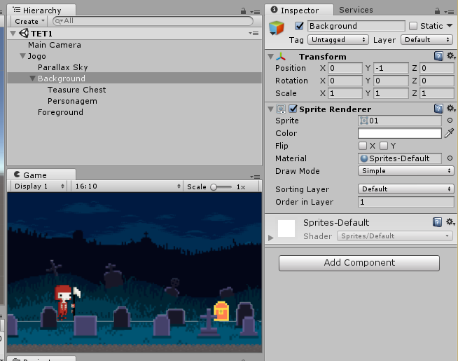

# Sobre

Esta pagina contém os textos escritos por Emiliandro FirminO, Jameson Pagini e Marco Henrique para a matéria de Tópicos Especiais 1 do curso de Tecnologia em Jogos Digitais, ministrado pelo prof. msc. Adriano Gil.

# Trabalho 01 - De2D aplicado em jogos Unity2D

## **Introdução**
**De2D** é um componente para Unity desenvolvido pelo usuário de Git Demigiant para agilizar a organização de camadas em projetos bidimensionais, e como parte da atividade T01 realizamos uma aplicação e abaixo se encontram os resultados obtidos.

**Produto final em vídeo:** [Link](https://youtu.be/xds5KW7ZZio)

## **De2DAutoSorter**

Organização de camadas é algo essencial para todo design ou ilustrador, e quando aplicado em jogos se torna uma ferramenta de igual importância quando se trabalha com engines drag-and-drop (Construct2D por exemplo), mas no Unity é algo um pouco obscuro.

Pois, é possível desenvolver tais camadas apenas com breve alterações no eixo Z, eventualmente se torna impossível sobreviver apenas com m esse vício, assim surgindo a necessidade do uso das layers do unity. Tendo isso em mente, __não seria mais fácil usar as layers desde cedo?__

**De2dAutoSorter** é uma benção na hora de organizar as camadas, de imediato o design/ilustrador entende como deve funcionar e ainda aprende outra importante lição dentro do jogo: organização da cena como um todo.

## **De2DCamera**

## **Considerações Finais**
